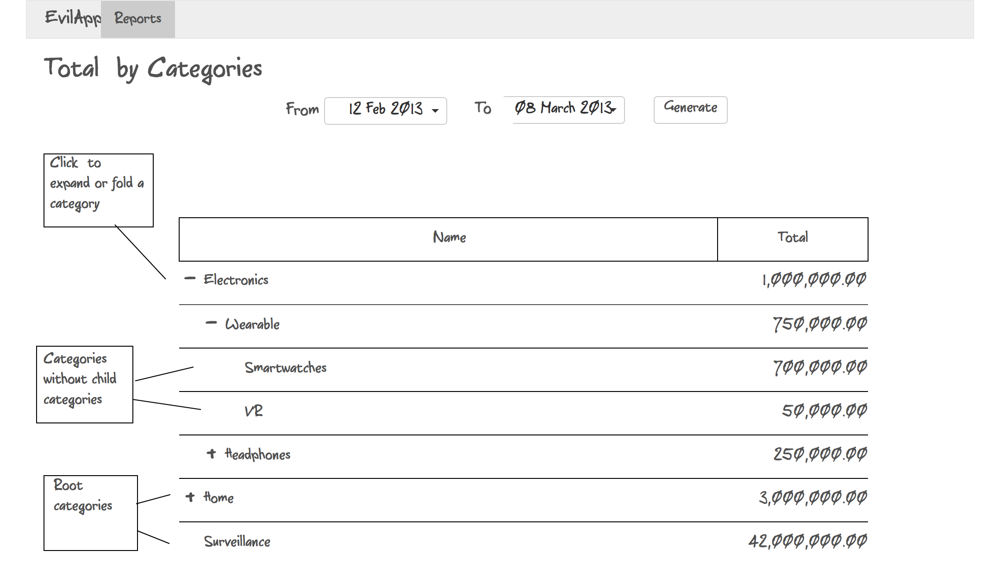

## HTTP Client with concurrency superpowers

Study OSI model, HTTP and implement a client app which can do multiple HTTP requests concurrently.


### Prerequisites

- Read about OSI model (definition, basic info)
- Read about (de)serialization
- Concurrency (definition, primitives etc)


## Tasks

There are 2 variants of this lab:
- [Report Generator](#report-generator)
- [Metrics Aggregator](#metrics-aggregator)

You have to choose and implement only one of them.

### Report Generator

There's a legacy system your new client want to extend (without access to its source code).
The existing system allows to get a list of orders made by client's customers and a list of categories.
The orders are quite simple - `created_at`, `total`, `user_id`, `category_id`. And a category isn't complicated as well - `id`, `name`, `category_id<nullable>`. Category is a simple recursive data structure (what means that some categories can have as parent another category, and there can be "root" categories which doesn't have a parent).


Your client wants from you a tool which can generate a new type of report - total per categories (including data from child descending categories).

You've got a simple sketch from the client.



There is some info about the legacy system you managed to get from your client:
- Categories URL `https://evil-legacy-service.herokuapp.com/api/v101/categories/`
- Orders URL `https://evil-legacy-service.herokuapp.com/api/v101/orders/`
- The client said that he had found a mysterious "key" `55193451-1409-4729-9cd4-7c65d63b8e76` for the legacy system

**Note:** The legacy system isn't documented properly (all you know about it - URL and that it must return CSV), 
so you need to read about HTTP and discover what additional info you may need to supply to get a response with requested data.


The application **must** offer next functionality:
- retrieve the list of orders (since it's a legacy system, it exports data in CSV format :( ) within a date interval
- retrieve the list of available categories (also CSV :( )
- parse and validate received data
- aggregate data
- display results to the user
- cache received data locally


There are some requirements, though:
- The application *should* have a friendly UI
- When the application is opened, it **must** load cached data if it's available
- All I/O operations **mustn't** block UI
- Requests **must** be performed concurrently **whenever it's possible**
- Aggregation of the data **must** performed concurrently
- Application **must** display results and cache them **concurrently**

### Metrics Aggregator

Your new client is a super secret organization which needs to collect a bunch of different metrics from an object and aggregate them.
An object is a real location that has some devices which collects data from sensors.
Each device has an `id`, `type` or `sensor_type` and a `value` which describes device's state.
So, `metrics` is just a fancy word for data which describes state of your object from a perspective (e.g. temperature, air pressure etc).

**Device/Sensor Types:**
- Temperature sensor - `0`
- Humidity sensor - `1`
- Motion sensor - `2`
- Alien Presence detector - `3`
- Dark Matter detector - `4`

However, there are some problems about those devices:
- Each device has its own URL and can be accessed only using a secret key
- Devices can return values in different formats (JSON, XML, CSV)
- Depending on format, a device can return multiple values (e.g. a box which has multiple sensors)
- Sometimes a device can respond you in up to `29 sec.`
- And the most important constraint - your secret key is valid only `30 sec.`
  (because the organization is super secret and don't want to leak access keys).

**Examples of some metrics:**

A single device in JSON format:
```
{
    "device_id": "123",
    "sensor_type": 0,
    "value": 100
}
```

A single device in XML format:
```
<?xml version="1.0" ?>
<device id="321">
    <type>1</type>
    <value>0.5</value>
</device>
```

A device with multiple sensors in CSV format:
```
device_id;sensor_type;value
132;3;0
132;4;50
```

Here's what functionality your app must offer:
1. Request your secret key at `https://desolate-ravine-43301.herokuapp.com/`, in response you'll receive a list of URLs (for each device)
2. Using your secret key, request data from all devices concurrently
3. If you get an error related to your access key, go back to **step 1** and retry
4. Parse data from all devices
5. Aggregate all responses ordering by sensor type (example of output below)

```
Temperature:
Device 123 - 100°C
Device 789 - 200°C

Humidity:
Device 312 - 0.5
Device 7 - 0.33

Alien Presence:
Device 132 - 0 (No aliens detected)

Dark Matter
Device 132 - 50 (is CERN' particle accelerator turned off?)
```


### Alternative tasks (TODO: Add basic requirements to at least one of the below)

#### Music Finder

#### Podcasts Browser

#### Wallpaper Crawler

