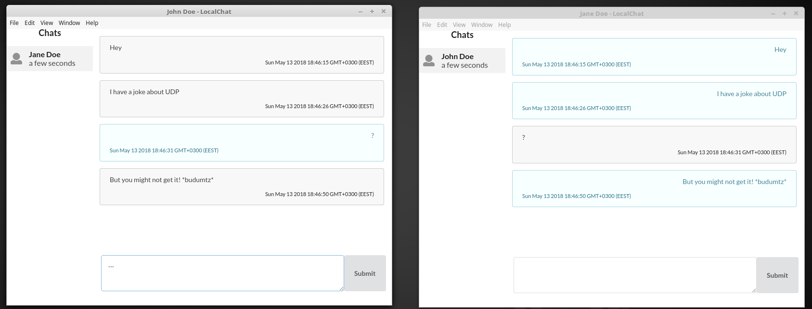

## UDP & Network Sniffers

Studierea comunicării aplicațiilor în rețea. Refers engineering-ul protocolului aplicației.
Implementarea clientului propriu conform protocolului existent.

### Prerequisites

- [Wireshark](https://www.wireshark.org/)
- Limbajul de programare: nu este restricționat. Însă să recomandă un limbaj dinamic cu REPL*.
- Cunoștințe despre: [modelul OSI](https://en.wikipedia.org/wiki/OSI_model) și IP

Note:
- Informație despre git și linkuri utile găsești în [procesul de sustinere](submission-process.md);

### Obiective

- Studierea protocolului de transport UDP și compararea acestuia cu TCP;
- Studierea metodelor de captare a datelor transmise prin rețea și analiza acestora;
- Elaborarea unei aplicații client care să lucreze cu o aplicație existentă.

## Sarcini

Aplicația care trebuie să o analizați este un chat rudimentar proiectat ca să lucreze între mai multe calculatoare aceleași rețele.

Aplicația poate fi descărcată pe link-urile de mai jos pentru următoare platforme:
- Linux [x86](examples/l6/localchat-0.1.0-i386.AppImage) / [x64](examples/l6/localchat-0.1.0-x86_64.AppImage) **testat** (download, make executable and run)
- [Windows](examples/l6/localchat 0.1.0.exe)
- [MacOS [x64]](examples/localchat-0.1.0-mac.zip)

Notă: Cea mai simplă metodă de a testa aplicația este să porniți 2+ instanțe a aplicației pe același calculator. Astfel e mai simplu de testat și analizat datele.

### Sarcina de bază (5 - 6)

Utilizînd 2-3 instanțe a aplicației și wireshark captați schimbul de date, analizați mesajele și descrieți într-un document protocolul aplicației.
Documentul trebuie să conțină:
- Descrierea structurii generale a mesajelor,
- Tipurile mesajelor,
- Ordinea/workflow-ul mesajelor

### Sarcini adiționale (+1 pentru fiecare sarcină)

- Descrieți care sunt neajunsurile protocolului și transportului aplicației. 
- Implementați o aplicație care adaugă un utilizator nou în chat-ul pornit,
- Implementați posibilitatea de a expedia/primi mesaje
- Descrieți cum poate fi combinat UDP și TCP pentru așa tip de aplicație, care ar fi motivul și avantajul unei astfel de abordări.

**Notă:** La moment, aplicația nu funcționează conform așteptărilor între calculatoare aceleași rețele. Instanțele aplicației pe același calculator, este metoda recomandată de testare.
